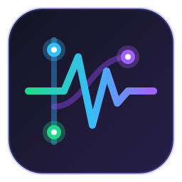

# ⚡ GitPulse HUD — Modern GTK4 / Libadwaita Git & Analytics Companion

<p align="center">
  
</p>

<p align="center">
  <strong>GitPulse HUD</strong> is a sleek, lightweight, semi-transparent Git micro-staging, Conventional Commits assistant, visual branch graph, and real-time repository pulse analytics companion for Linux developers. Built with GTK4 & Libadwaita, featuring Cairo vector graphics, pre-commit secret scanning, tactile haptic sound feedback, and live GitHub cloud traffic & telemetry insights.
</p>

<p align="center">
  <a href="https://boosty.to/xronni/single-payment/donation/809763/target?share=target_link"></a>
  
  
  
  
  
</p>

---

## 🌐 Navigation / Навигация
* 🇺🇸 [English Version](#-english-version)
* 🇷🇺 [Русская версия](#-русская-версия)

---

## 🇺🇸 English Version

### ✨ Key Features

* ⚡ **Micro-Staging & Instant Diff:**
  * Real-time tracking of staged, unstaged, and untracked files.
  * One-click individual staging or batch "Stage All" / "Unstage All".
  * Integrated inline colorized Diff Viewer with addition/deletion line highlighting.
* 🌿 **Interactive Branch Tree & Visual Git Graph:**
  * Custom Cairo supersampled vector graphics rendering parallel branch tracks with distinct color lanes.
  * Smooth branch merge curves and commit node glow indicators.
  * Top bar branch switcher dropdown with 1-click `git checkout`.
* 📦 **Git Stash Shelf & Inspector:**
  * Dedicated split-view modal dialog displaying all stored stashes with relative timestamps and messages.
  * Real-time syntax-colored diff preview (`+green`, `-red`).
  * 1-Click **Apply**, **Pop**, and **Drop** actions.
* 🛡️ **Pre-Commit Secret Scanner:**
  * Ultra-fast (<3ms) local analysis of staged diffs before commit.
  * Proactively detects leaked GitHub PATs (`ghp_`), API keys (OpenAI, Anthropic, AWS, Google), private keys (`id_rsa`, `.pem`), and sensitive configuration files (`.env`, `credentials.json`).
  * Live status pill in Commit Composer with masked previews (`ghp_••••••••xxxx`) and commit interception warnings.
* 🚀 **One-Click Release Drafter & Changelog Synthesizer:**
  * Scans commits since the latest git tag and auto-synthesizes structured release notes grouped by Conventional Commits (`Features`, `Bug Fixes`, `Documentation`, `Performance`, `Maintenance`).
  * Automatic semver suggestion (`vX.Y.Z`).
  * 1-Click Markdown clipboard export and Git tag creation.
* ⚡ **Spotlight Quick Switcher (Ctrl+K):**
  * Instant repository switcher modal with fuzzy search.
  * Live status indicators: active branch badges, `clean` tree badges, and uncommitted change counters.
* ✍️ **Conventional Commits Composer:**
  * Quick selector for commit types (`feat`, `fix`, `refactor`, `docs`, `perf`, `chore`, `test`, `style`).
  * Optional scope field, breaking change toggle (`!`), and live preview pill.
  * 1-Click "Commit" and "Commit & Push" with automatic remote sync.
* 📊 **Local Repository Pulse & Analytics:**
  * **Commit Velocity:** Smooth vector bar chart drawn with Cairo showing commits across the last 14 days.
  * **24h Punchcard Rhythm:** Hourly heatmap uncovering peak developer productivity hours (00h..23h).
  * **Recent Commits Feed:** Interactive timeline with 1-click commit hash clipboard copying.
* 🌐 **GitHub Cloud Telemetry & Insights:**
  * 👀 **Page Views & 👤 Unique Visitors:** 14-day traffic trend chart.
  * 🌐 **Top Referrers:** Real traffic sources (Habr, Reddit, Telegram, Google, YouTube).
  * ⭐ **Stars & 🍴 Forks:** Live stargazer and fork counters.
  * 📦 **Asset Download Counters:** Exact download counts for every release binary (`.deb`, `.tar.gz`, `.zip`).
  * 👍 ❤️ 🚀 **Community Reactions:** Aggregated emoji sentiment on releases and issues.
* 🔊 **Tactile Sound Engine (Zero External Dependencies):**
  * Procedurally synthesized in-memory haptic sounds using pure Python wave math.
  * Mechanical switch click on stage/unstage, satisfying chord chime on commit, ascending swoosh on push.
* 🎨 **Dark Glassmorphic Libadwaita Aesthetic:**
  * Official Libadwaita CSD window decorations (zero duplicate titlebars).
  * Bilingual interface (English / Russian) toggleable on the fly with smooth 1.5s refresh animation.

---

### 📥 Installation & Quickstart

#### Requirements
* Linux OS (Ubuntu, Debian, Fedora, Arch, openSUSE, etc.)
* Python 3.10+
* PyGObject with GTK4 & Libadwaita (`python3-gi`, `gir1.2-gtk-4.0`, `gir1.2-adw-1`, `python3-cairo`)

```bash
# Ubuntu / Debian / Pop!_OS / Linux Mint:
sudo apt update && sudo apt install -y python3 python3-gi python3-gi-cairo gir1.2-gtk-4.0 gir1.2-adw-1 git

# Fedora:
sudo dnf install -y python3-gobject gtk4 libadwaita git python3-cairo

# Arch Linux / Manjaro:
sudo pacman -S --needed python-gobject gtk4 libadwaita git python-cairo
```

#### Run Directly
```bash
git clone https://github.com/Xronni/git-pulse-hud.git
cd git-pulse-hud
./run.sh
```
*(The launcher automatically verifies dependencies on clean OS installations and offers 1-click package setup)*

#### Install Desktop Application
```bash
./install.sh
```
Now **GitPulse HUD** appears in your desktop application launcher with its native icon!

#### Run Verification Suite
```bash
./test.sh
```
Runs 36 automated functional, unit, and integration tests across all subsystems.

---

### 📂 Project Architecture

```
git-pulse-hud/
├── main.py              # Main Application Window & GTK4 Event Loop
├── git_engine.py        # High-performance Git CLI & Porcelain Parser
├── github_telemetry.py  # GitHub API client (Views, Referrers, Downloads, Reactions)
├── pulse_widget.py      # Cairo DrawingArea widgets (Velocity, Punchcard, Views, Graph)
├── diff_viewer.py       # Syntax-highlighted inline Diff Dialog
├── stash_dialog.py      # Stash Shelf & Inspector modal with instant diff
├── release_dialog.py    # One-click Conventional Release Drafter & Tag Creator
├── secret_scanner.py    # Pre-commit zero-dependency regex secret scanner
├── quick_switcher.py    # Spotlight-style repository switcher (Ctrl+K)
├── sound_engine.py      # Pure Python procedural audio generator & player
├── i18n.py              # Bilingual localization (English / Russian)
├── style.css            # Modern glassmorphism CSS stylesheets
├── verify_app.py        # 36-test automated pre-deployment verification suite
├── run.sh               # Intelligent launcher with clean OS dependency detection
├── install.sh           # Linux desktop entry installer
├── uninstall.sh         # Clean uninstaller
├── test.sh              # Fast test runner script
├── assets/
│   └── icon.png         # Modern 256x256 application logo
├── README.md            # Bilingual documentation & showcase
└── LICENSE              # MIT License
```

---

## 🇷🇺 Русская версия

### ✨ Основные возможности

* ⚡ **Микро-стейджинг и просмотр Diff:**
  * Отслеживание подготовленных (staged), измененных (unstaged) и новых файлов в реальном времени.
  * Стейджинг в один клик или пакетные «Подготовить всё» / «Отменить подготовку».
  * Встроенное окно просмотра диффа с подсветкой добавленных (`+`) и удаленных (`-`) строк.
* 🌿 **Интерактивное дерево веток и граф Git:**
  * Векторный рендер графа на Cairo с параллельными дорожками разных цветов.
  * Плавные кривые слияния (merge) и индикаторы узлов коммитов.
  * Выпадающее меню переключения веток в 1 клик (`🌿 <ветка> ▾`).
* 📦 **Полка и инспектор Git Stash:**
  * Отдельное окно управления тайниками с датами и сообщениями.
  * Моментальный предпросмотр diff каждого тайника с синтаксической подсветкой.
  * Кнопки «Применить», «Восстановить» и «Удалить» в 1 клик.
* 🛡️ **Встроенный сканер секретов (Pre-Commit Scanner):**
  * Молниеносный анализ подготовленных файлов перед созданием коммита (<3 мс).
  * Обнаружение токенов GitHub (`ghp_`), API-ключей (OpenAI, Anthropic, AWS, Google), приватных ключей (`id_rsa`, `.pem`) и файлов окружения (`.env`).
  * Замаскированные превью (`ghp_••••••••xxxx`) и защита от случайной утечки секретов в репозиторий.
* 🚀 **Конструктор релизов и синтезатор ченджлога:**
  * Автоматический сбор коммитов с момента последнего тега по Conventional Commits (`✨ Возможности`, `🐛 Исправления`, `📚 Документация`, `⚡ Производительность`, `🔨 Рефакторинг`).
  * Расчёт следующего номера версии (`vX.Y.Z`).
  * Копирование Markdown в буфер и создание Git-тега в 1 клик.
* ⚡ **Быстрый переход между проектами (Ctrl+K):**
  * Всплывающее Spotlight-окно поиска недавних репозиториев.
  * Индикаторы активной ветки и статуса изменений (`clean` / `● N изменений`).
* ✍️ **Конструктор Conventional Commits:**
  * Быстрый выбор типов коммита (`feat`, `fix`, `refactor`, `docs`, `perf`, `chore`, `test`, `style`).
  * Поле скоупа, флаг критических изменений (`!`) и живое превью сообщения.
  * Кнопки «Создать коммит» и «Коммит и отправка».
* 📊 **Пульс репозитория и локальная аналитика:**
  * **Динамика коммитов:** Векторный график активности за последние 14 дней на Cairo.
  * **24-часовой Punchcard:** Распределение коммитов по часам суток (00ч..23ч).
  * **Хронология коммитов:** Список с копированием хеша в буфер в 1 клик.
* 🌐 **Метрики и телеметрия GitHub:**
  * 👀 **Просмотры (Page Views) & 👤 Уникальные посетители:** График посещаемости за 14 дней.
  * 🌐 **Источники переходов (Рефереры):** Сайты, откуда приходят разработчики (Telegram, Habr, Reddit, Google).
  * ⭐ **Звёзды & 🍴 Форки:** Счётчики популярности.
  * 📦 **Счётчик скачиваний файлов релизов:** Количество загрузок бинарников (`.deb`, `.zip`, `.tar.gz`).
  * 👍 ❤️ 🚀 **Реакции сообщества:** Суммарные эмодзи-реакции на релизах и тикетах.
* 🔊 **Тактильный звуковой движок:**
  * Процедурный синтез приятных кликов, аккорда подтверждения коммита и звука пуша на чистом Python без внешних файлов.
* 🎨 **Стиль Dark Glassmorphic Libadwaita:**
  * Официальные заголовки окон CSD без дублирования рамок.
  * Мгновенное переключение языка (RU / EN) на лету.

---

### 🛠️ Запуск и установка

```bash
# Запуск:
./run.sh

# Установка в систему с иконкой и ярлыком в меню приложений:
./install.sh

# Запуск полного набора из 36 тестов:
./test.sh
```

---

### ☕ Поддержка автора / Support
Если вам понравился проект, вы можете поддержать развитие на Boosty:  
👉 **[Поддержать на Boosty](https://boosty.to/xronni/single-payment/donation/809763/target?share=target_link)**

---

### 📄 Лицензия
Распространяется под лицензией **MIT**. Подробнее в файле [LICENSE](LICENSE).
