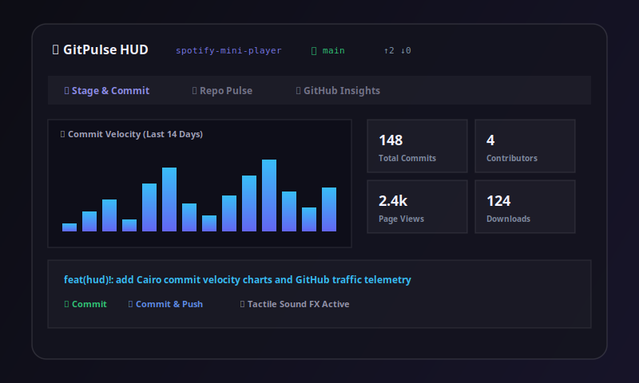

# ⚡ GitPulse HUD — Modern GTK4 / Libadwaita Git & Analytics Companion

<p align="center">
  
</p>

<p align="center">
  <strong>GitPulse HUD</strong> is a sleek, lightweight, semi-transparent Git micro-staging, Conventional Commits assistant, and real-time repository pulse analytics companion for Linux developers. Built with GTK4 & Libadwaita, featuring Cairo-rendered charts, tactile haptic UI sounds, and full GitHub cloud traffic & telemetry insights.
</p>

<p align="center">
  <!-- Place your demo.gif or preview screenshot in the assets folder -->
  
</p>

<p align="center">
  <a href="https://boosty.to/xronni/single-payment/donation/809763/target?share=target_link"></a>
  
  
  
  
  
</p>

---

## 🌐 Navigation / Навигация
* 🇺🇸 [English Version](#-english-version)
* 🇷🇺 [Русская версия](#-русская-версия)

---

## 🇺🇸 English Version

### ✨ Key Features

* ⚡ **Micro-Staging & Instant Diff:**
  * Real-time tracking of staged, unstaged, and untracked files.
  * One-click individual staging or batch "Stage All" / "Unstage All".
  * Integrated inline colorized Diff Viewer with addition/deletion line highlighting.
* ✍️ **Conventional Commits Composer:**
  * Quick selector for commit types (`feat`, `fix`, `refactor`, `docs`, `perf`, `chore`, `test`, `style`, `ci`).
  * Optional scope field, breaking change toggle (`!`), and live preview pill.
  * 1-Click "Commit" and "Commit & Push" with automatic remote sync.
  * Stash & Pop stash quick actions.
* 📊 **Local Repository Pulse & Analytics:**
  * **Commit Velocity:** Smooth vector bar chart drawn with Cairo showing commits across the last 14 days.
  * **24h Punchcard Rhythm:** Hourly heatmap uncovering peak developer productivity hours (00h..23h).
  * **Recent Commits Feed:** Interactive timeline with 1-click commit hash clipboard copying.
  * Repository summary: total commits, contributors count, tracked files.
* 🌐 **GitHub Cloud Telemetry & Insights (Zero-Configuration):**
  * 👀 **Page Views:** Total views over the last 14 days with daily trend chart.
  * 👤 **Unique Visitors:** Count of distinct users visiting the repo.
  * 🌐 **Top Referrers:** Real traffic sources (e.g. Habr, Reddit, Telegram, Google, YouTube).
  * ⭐ **Stars & 🍴 Forks:** Live stargazer and fork counters.
  * 📦 **Asset Download Counters:** Exact download counts for every release binary (`.deb`, `.tar.gz`, `.zip`).
  * 👍 ❤️ 🚀 **Community Reactions:** Aggregated emoji sentiment on releases and issues.
  * 💬 **Feedback Tracker:** Open issues and discussions tracker.
* 🔊 **Tactile Sound Engine (Zero External Dependencies):**
  * Procedurally synthesized in-memory haptic sounds using pure Python wave math.
  * Mechanical switch click on stage/unstage, satisfying chord chime on commit, ascending swoosh on push.
  * Instant toggle (🔊 / 🔇) in header bar.
* 🎨 **Dark Glassmorphic Libadwaita Aesthetic:**
  * Translucent backdrop, rounded acrylic corners, subtle borders.
  * Bilingual interface (English / Русский) toggleable on the fly.

---

### 📥 Installation & Quickstart

#### Requirements
* Linux OS (Ubuntu, Debian, Fedora, Arch, etc.)
* Python 3.10+
* PyGObject with GTK4 & Libadwaita (`python3-gi`, `gir1.2-gtk-4.0`, `gir1.2-adw-1`)

```bash
# Ubuntu / Debian:
sudo apt install python3 python3-gi gir1.2-gtk-4.0 gir1.2-adw-1

# Arch Linux:
sudo pacman -S python-gobject gtk4 libadwaita
```

#### Run Directly
```bash
git clone https://github.com/Xronni/git-pulse-hud.git
cd git-pulse-hud
./run.sh
```

#### Install Desktop Application
```bash
./install.sh
```
Now **GitPulse HUD** appears in your desktop application launcher!

---

### 📂 Project Architecture

```
git-pulse-hud/
├── main.py              # Main Application Window & GTK4 Event Loop
├── git_engine.py        # High-performance Git CLI & Porcelain Parser
├── github_telemetry.py  # GitHub API client (Views, Referrers, Downloads, Reactions)
├── pulse_widget.py      # Cairo DrawingArea widgets (Velocity, Punchcard, Views)
├── diff_viewer.py       # Syntax-highlighted inline Diff Dialog
├── sound_engine.py      # Pure Python procedural audio generator & player
├── i18n.py              # Bilingual localization (English / Russian)
├── style.css            # Modern glassmorphism CSS stylesheets
├── run.sh               # Quick executable runner
├── install.sh           # Linux desktop entry installer
├── uninstall.sh         # Clean uninstaller
├── assets/
│   └── icon.png         # 256x256 modern application logo
├── README.md            # Documentation & showcase
└── LICENSE              # MIT License
```

---

## 🇷🇺 Русская версия

### ✨ Основные возможности

* ⚡ **Микро-стейджинг и просмотр Diff:**
  * Отслеживание подготовленных (staged), измененных (unstaged) и новых файлов в реальном времени.
  * Стейджинг в один клик или пакетные «Стейджить всё» / «Снять всё».
  * Встроенное окно просмотра диффа с подсветкой добавленных (`+`) и удаленных (`-`) строк.
* ✍️ **Конструктор Conventional Commits:**
  * Удобный выбор типов коммита (`feat`, `fix`, `refactor`, `docs`, `perf`, `chore`, `test` и др.).
  * Поле скоупа, флаг ломающих изменений (`!`) и «живое» превью сообщения.
  * Кнопки «Коммит» и «Коммит & Пуш» с мгновенной синхронизацией.
  * Быстрый Stash и извлечение из Stash.
* 📊 **Пульс репозитория и локальная аналитика:**
  * **Скорость коммитов (Commit Velocity):** Сглаженный векторный график на Cairo за последние 14 дней.
  * **24-часовой Punchcard:** Почасовая карта активности для определения пика продуктивности (00ч..23ч).
  * **Лента недавних коммитов:** Интерактивная хронология с копированием хеша коммита в буфер в один клик.
* 🌐 **Метрики и телеметрия GitHub:**
  * 👀 **Просмотры страниц (Page Views):** График и счетчик открытий страницы проекта за 14 дней.
  * 👤 **Уникальные посетители (Unique Visitors):** Количество уникальных разработчиков, посетивших репозиторий.
  * 🌐 **Источники переходов (Referrers):** Сайты, откуда приходит трафик (Хабр, Reddit, Telegram, Google, YouTube).
  * ⭐ **Звёзды & 🍴 Форки:** Актуальные счетчики популярности.
  * 📦 **Счётчик скачиваний релизов:** Точное количество загрузок каждого прикрепленного бинарника (`.deb`, `.zip`, `.tar.gz`).
  * 👍 ❤️ 🚀 **Реакции сообщества:** Суммарные эмодзи-реакции на релизах и тикетах.
  * 💬 **Обратная связь:** Трекинг открытых тикетов (Issues) и обсуждений.
* 🔊 **Тактильный звуковой движок:**
  * Процедурный синтез приятных кликов переключателей, аккорда подтверждения коммита и звука отправки на GitHub без внешних аудио-зависимостей.
  * Мгновенное включение/отключение звука (🔊 / 🔇) в шапке.
* 🎨 **Стиль Dark Glassmorphic Libadwaita:**
  * Полупрозрачные акриловые панели с мягкими скруглениями и тонкими рамками.
  * Переключение языка интерфейса (RU / EN) в один клик.

---

### 🛠️ Запуск и установка

```bash
# Запуск:
./run.sh

# Установка в систему с иконкой и ярлыком в меню приложений:
./install.sh
```

---

### ☕ Поддержка автора / Support
Если вам понравился проект, вы можете поддержать развитие на Boosty:  
👉 **[Поддержать на Boosty](https://boosty.to/xronni/single-payment/donation/809763/target?share=target_link)**

---

### 📄 Лицензия
Распространяется под лицензией **MIT**. Подробнее в файле [LICENSE](LICENSE).
